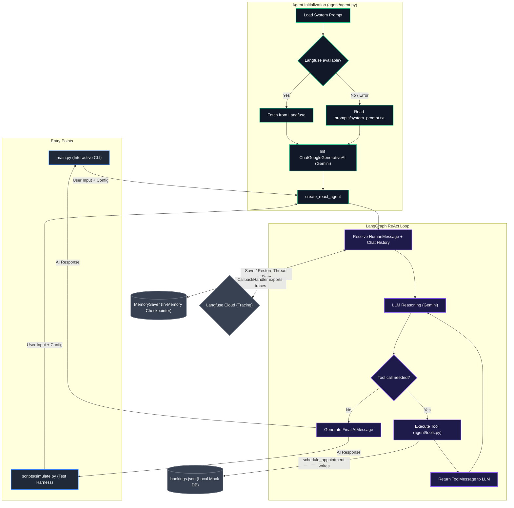
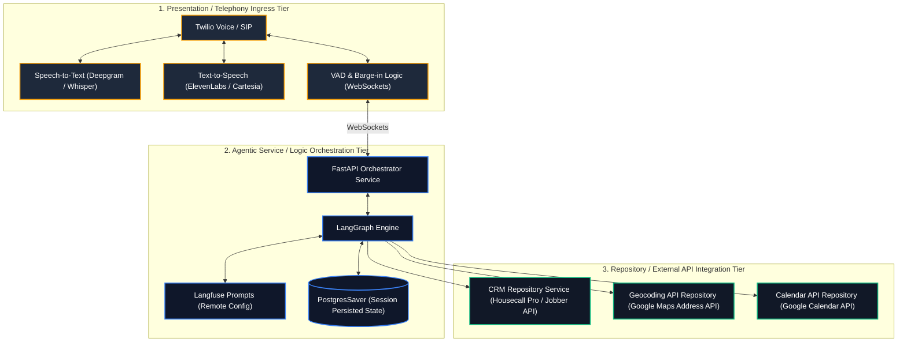

# Jacobs Plumbing — AI Call Assistant

This repository contains the implementation of an agentic AI Call Assistant built for Jacobs Plumbing. The assistant is designed to handle inbound customer calls when Nick (the business owner) is unavailable, managing bookings professionally and efficiently as modeled in real call recordings.


---

## Technology Stack & Architecture

- **LLM Core**: Google Gemini 3.1 Flash Lite (`gemini-3.1-flash-lite`) — Selected for its low latency, cost efficiency, and reliable tool-calling performance.
- **Agentic Framework**: LangGraph (via `create_react_agent` from `langgraph.prebuilt`) — The standard for building stateful, loop-based agents with message checkpointers.
- **Observability & Prompt Management**: Langfuse — Used for execution tracing, latency monitoring, and remote prompt management with local fallback safety.
- **Testing Framework**: Python standard `unittest` library for mock tools validation.
- **Languages & Utilities**: Python 3.12, `python-dotenv` for local configuration, and standard Python `csv` library for robust file reading.



---

## Project Structure

```
call-assistant/
├── .gitignore                         # Excludes secrets (.env), database outputs, and caches
├── requirements.txt                   # Pinned dependency list
├── .env.example                       # Environment variables template
├── main.py                            # Interactive console app entrypoint
├── agent/
│   ├── __init__.py                    # Public API exports
│   ├── agent.py                       # LangGraph React Agent loop with MemorySaver checkpointer
│   ├── tools.py                       # Mock tools (with logging, validation, UUIDs, and date checks)
│   └── config.py                      # Configurations, global constants, and credential safeguards
├── prompts/
│   └── system_prompt.txt              # System Prompt with versioning, few-shots, and error recovery
├── scripts/
│   └── simulate.py                    # Independent simulation runner and evaluation harness
└── tests/
    └── test_tools.py                  # Standalone unit tests for mock tools
```

---

## Prompt Engineering Methodology

The system prompt in `prompts/system_prompt.txt` is designed using conversational voicebot principles:

1. **Linear Conversation Flow**: Telephony voicebots must collect info sequentially. The prompt dictates a strict 9-step sequence (Greeting -> Identify Caller -> Address Check -> Service Check -> Suggest Slot -> Phone Number -> Schedule -> Confirm -> Goodbye) to prevent the model from asking multiple questions at once.
2. **Proactive Scheduling**: Right after identifying the plumbing issue, the AI proactively checks availability and suggests a convenient default slot ("tomorrow at 10 AM"). This matches the call recording flow and reduces total conversation turns.
3. **Voicebot Constraints**: Telephony requires low latency and quick turns. The model is instructed to write short, single-sentence responses suited for Text-to-Speech (TTS) integration.
4. **Strict Guardrails**:
   - **No Pricing Quotes**: Prevents hallucinations on pricing. The assistant states that the technician will inspect on-site and offer estimates.
   - **Plumbing Scope**: Politely refutes non-plumbing requests (e.g., electrical or heating).
   - **Use Tools**: Explicitly instructs the model on how to interpret mock tool outputs (e.g. an empty list from availability checks means the slot is open).
5. **Few-Shot Examples**: Includes 2 example conversation logs directly inside the prompt to guide output formats, tool calling sequences, and context retention.
6. **Error Recovery Instructions**: Guides the model on handling invalid or incomplete inputs gracefully (e.g., vague addresses, incorrect phone formats).

---

## Mock Tool Design

The mock tools in `agent/tools.py` have been implemented with robust validation and collision-free identifier logic:

- **UUID Booking ID**: Replaced random integer IDs with collision-free, standard short UUID strings (`uuid.uuid4().hex[:8].upper()`).
- **Input Validation**: All tools validate inputs at entry (checking for blank inputs and verifying phone formats using digit count checks), raising informative ValueError exceptions.
- **Date-Aware Availability**: `check_availability` validates weekends and marks Sundays as closed, returning alternative Monday dates to test calendar logic.
- **Robust Area Checks**: `check_service_area` uses regular expression word-boundary checking (`\bspringfield\b` and `\bmain street\b`) rather than naive substring matching to avoid false positives (like "Springfieldville").
- **Observability Logging**: Every tool records calls and validation results using the standard library `logging` module.

---

## Security & Observability

- **Git Version Control**: Clean Git repository initialized with a `.gitignore` excluding local configurations (`.env`) to prevent accidental commits of API keys.
- **Langfuse Credentials Protection**: In `agent/config.py`, the loader cleans and verifies environment variables. If credentials remain set to placeholder text (e.g. `your_...`), it automatically disables Langfuse to prevent 401 exceptions from polluting stdout.
- **Observability Tracing**: Traces user queries, tool parameters, and LLM completions to Langfuse using unique `configurable.thread_id` session identifiers.

---

## Setup & Installation (Docker Compose)

Docker Compose is the recommended way to run this project to ensure a consistent environment across different machines.

### 1. Configure Environment Variables
Copy `.env.example` to `.env`:
```bash
cp .env.example .env
```

Fill in your API Keys:
```env
# Gemini API Key (Required)
GOOGLE_API_KEY=AIzaSy...

# Langfuse Observability Config (Optional)
LANGFUSE_PUBLIC_KEY=your_langfuse_public_key_here
LANGFUSE_SECRET_KEY=your_langfuse_secret_key_here
LANGFUSE_HOST=https://cloud.langfuse.com
```

### 2. Initialize Database File
Initialize the local database file on your host machine to enable database persistence:
```bash
# On Windows PowerShell:
New-Item -Path . -Name "bookings.json" -ItemType "file" -Force

# On macOS/Linux/Git Bash:
touch bookings.json
```

### 3. Build the Docker Image
Build the local container environment:
```bash
docker compose build
```

---

## Running & Verification

All tasks are defined as docker-compose services. Use the following commands to run the system:

### 1. Run Isolated Unit Tests
Verify all mock tool behaviors, boundary conditions, validations, and date logic inside a clean container:
```bash
docker compose run --rm tests
```

### 2. Run Interactive Console Mode
Act as a caller and interact with the assistant in real-time inside Docker (stdin/TTY is fully supported):
```bash
docker compose run --rm assistant
```

### 3. Run Simulation & Evaluation Harness
Run the automated CSV scenario simulation:
```bash
# Run the main happy path scenario
docker compose run --rm simulator

# Run specific edge case scenarios
docker compose run --rm simulator python scripts/simulate.py --csv scripts/test_case_unavailable_time.csv
docker compose run --rm simulator python scripts/simulate.py --csv scripts/test_case_out_of_area.csv
```

All simulations run semantic checks, tool call inspections, and structured database audits, printing an **EVALUATION SUMMARY REPORT** at the end.

---

## Alternative: Local Python Environment

If you prefer to run the project directly on your host machine without Docker:

### 1. Install Dependencies
```bash
pip install -r requirements.txt
```

### 2. Run Standalone Unit Tests
```bash
python -m unittest tests/test_tools.py
```

### 3. Run Interactive CLI
```bash
python main.py
```

### 4. Run Simulation Harness
```bash
python scripts/simulate.py --csv scripts/main_scenario.csv
```

---

## Consistency & Evaluation Results

To guarantee that the AI agent follows instructions consistently and calls tools in the correct order, we verify the results against the predefined conversational paths. The simulation results are as follows:

| Simulation Scenario | Test CSV | Passed Assertions | Success Rate | Verification Goal |
|---|---|---|---|---|
| **Main Scenario (Happy Path)** | [main_scenario.csv](file:///c:/Users/PC/Documents/GitHub/call-assisstant/scripts/main_scenario.csv) | 12 / 12 | **100%** | Verification of greeting, service check, availability check, phone collection, scheduling tool call, Booking ID confirmation, and structured database logging in `bookings.json`. |
| **Edge Case 1: Slot Unavailable** | [test_case_unavailable_time.csv](file:///c:/Users/PC/Documents/GitHub/call-assisstant/scripts/test_case_unavailable_time.csv) | 15 / 15 | **100%** | Verification of weekend/closed date handling, alternative slot suggestion, scheduling update, phone validation, and correct database entry. |
| **Edge Case 2: Out of Area** | [test_case_out_of_area.csv](file:///c:/Users/PC/Documents/GitHub/call-assisstant/scripts/test_case_out_of_area.csv) | 6 / 6 | **100%** | Verification of geographic boundary check, polite decline flow, and auditing that **no record** is written to `bookings.json`. |

These tests ensure that prompt modifications or model changes do not introduce behavioral regressions before deploying.

---

## Limitations

1. **Educational & Conceptual Scope**: This codebase is intentionally kept simple to outline agentic design patterns and tool-calling flows. It avoids over-engineering by using straightforward mock systems rather than complex enterprise plumbing.
2. **Mock Data Dependencies**: The scheduling database, calendar availability check, and service area filters are implemented as simple mock tools operating on regex rules and static files. They do not interface with actual production CRMs or operational backend services.
3. **Simplified Address Parsing**: Geographic service checks are handled via regex word-boundary matching rather than full Geocoding APIs. It is a conceptual implementation that does not support typos, zip-code mappings, or coordinate containment checks.
4. **Telephony & Real-Time Constraints**: Being a CLI-based prototype, it does not implement telephony ingress elements (e.g., Twilio integration, low-latency streaming Speech-to-Text/Text-to-Speech), Voice Activity Detection (VAD), or speech barge-in (interruption) handling.
5. **No Production Database Checkpointer**: The chat state checkpointing is done via memory (`MemorySaver`). For production multi-tenant scaling, this would be swapped for persistent stores (e.g., PostgreSQL or Redis).

---

## Future Development & Production Architecture

If scaling this call assistant into a commercial-grade, multi-tenant enterprise system, we would transition the simple script into a 3-Tier Layered Architecture as detailed below:



### Architectural Breakdown:

1. **Presentation / Ingress Layer**:
   - Integrates Twilio or WebRTC streams with low-latency Speech-to-Text (e.g., Deepgram Streaming API) and Text-to-Speech (e.g., ElevenLabs / Cartesia).
   - Implements WebSockets to support real-time Voice Activity Detection (VAD) enabling the caller to interrupt the bot naturally (barge-in handling).

2. **Agentic Logic Layer (Service Layer)**:
   - Exposes clean REST API endpoints using FastAPI.
   - Runs LangGraph execution loops, persisting conversation states in a relational database checkpointer (e.g., PostgreSQL using `PostgresSaver`).
   - Retrieves prompts dynamically from Langfuse to enable prompt tuning without redeploying code.

3. **Data Access & Integration Layer (Repository Layer)**:
   - Encapsulates mock tools in production-grade repositories:
     - **CRM Repository**: Interfaces with scheduling tools (e.g., Housecall Pro, Jobber) to create customer records and book jobs.
     - **Geocoding Repository**: Uses Google Maps Address Validation API to parse, correct, and geocode addresses.
     - **Calendar Repository**: Integrates with Google Calendar API or custom database schemas to query technician availability in real time.

### CI/CD Evaluation & Prompt Safeguards:
- Integrate `promptfoo` in the CI/CD pipeline to automatically run conversational evaluations on every prompt commit.
- Define test suites with LLM-as-a-judge assertions to verify semantic output quality and prevent model behavior regressions before code pushes.
